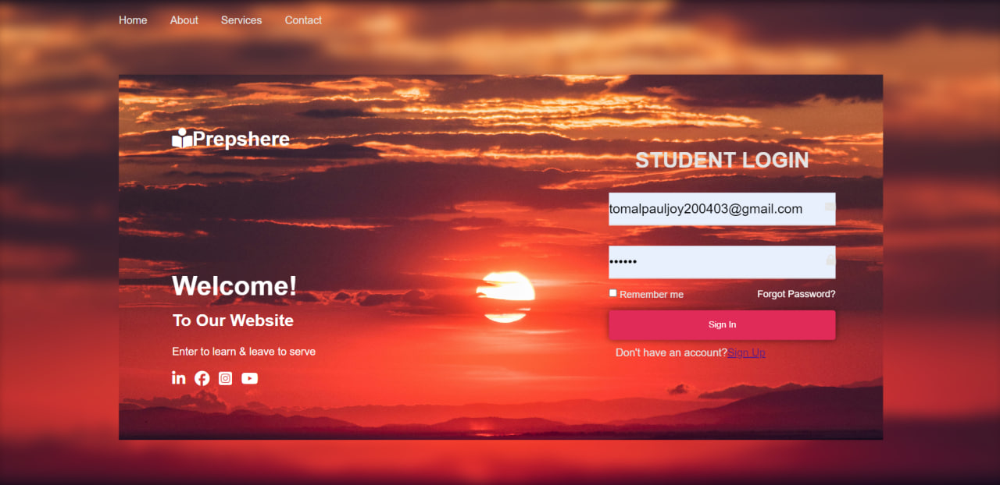
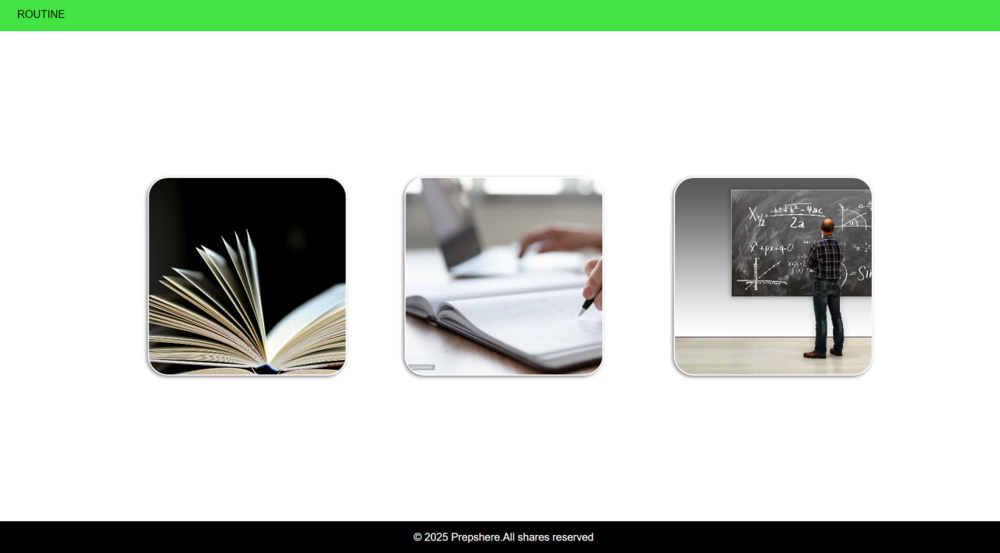
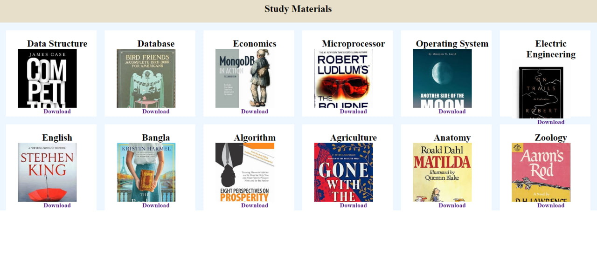
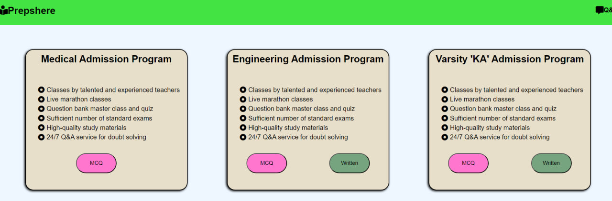
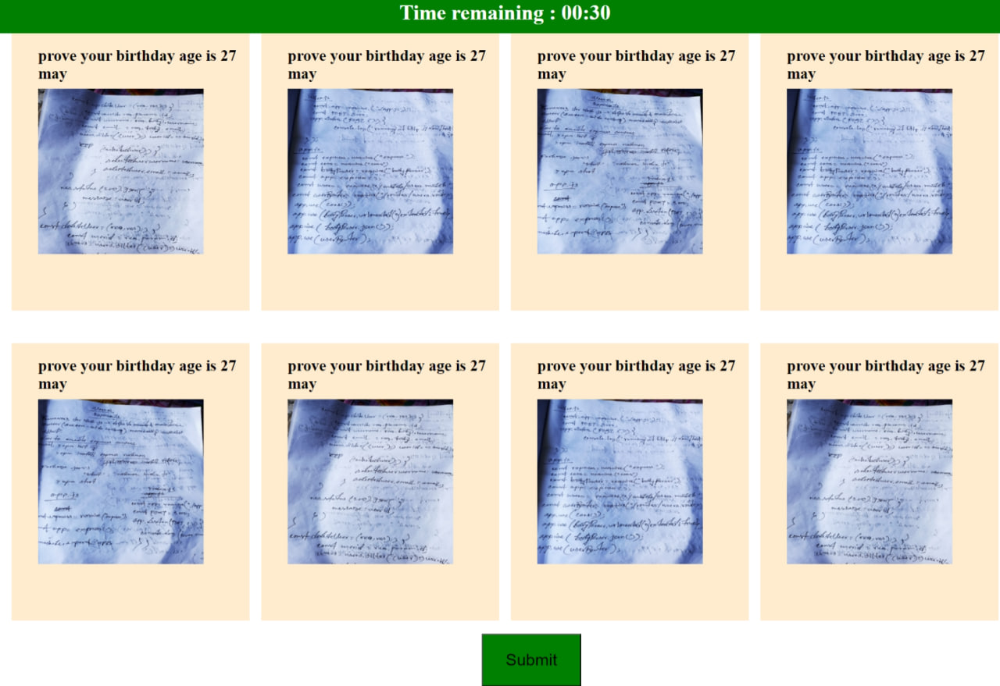
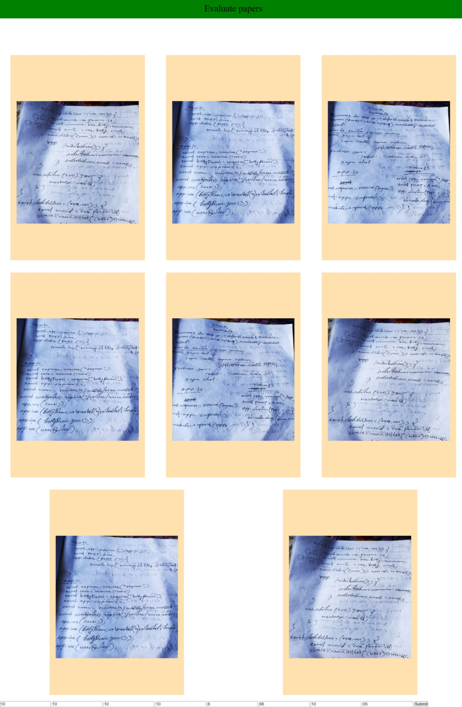
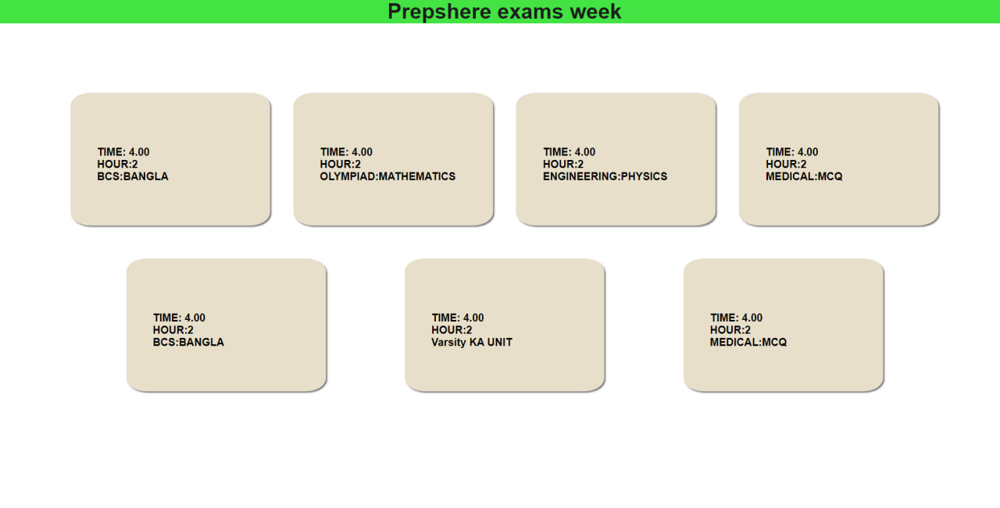

# PrepShere

# Project's Title 
Educational Platform that helps you for being qualitive

# Project Description
Prepshere is your go-to platform for effortless learning. Access notes, join lectures, and take exams—all in one place. Whether catching up or preparing for tests, Prepshere ensures you're always ready to excel.

# Tech Stack
- **Frontend**:
 
 

- **Backend**: 

- **Environment**:

- **Data Handling**: 

## Features

### Student Features
- **Registration/Login**: Secure sign-up and login process.
- **Access Notes**: View and study comprehensive notes.
- **Attend Lectures**: Watch teacher-uploaded lecture videos.
- **Participate in Exams**: Take multiple-choice and written exams.

### Teacher Features
- **Registration/Login**: Secure sign-up and login process.
- **Upload Content**: Upload notes and lecture videos for students.
- **Evaluate Exams**: Assess student performance in exams.

### Question Management
- **Custom Question Setting**: Create and manage exam questions using HTML, CSS, and JavaScript.

## Usage Instructions

### For Students

**Register/Log In:**
1. Navigate to the login page.
2. If you are a new user, click on "Sign Up" to create an account. Enter the required details and submit the form.
3. If you already have an account, enter your email and password, then click "Log In."

**Access Notes:**
1. After logging in, go to the "comprehensive Study Material" section from your dashboard.
2. Browse through the available notes by subject or course.
3. Click on the desired note to view and study it.

**Attend Lectures:**
1. From your dashboard, navigate to the "Expert Guidence" section.
2. Browse the list of available lecture videos.
3. Click on a video to start watching. Use the playback controls to pause, rewind, or fast-forward.

**Participate in Exams:**
1. Go to the "Practice Test" section from your dashboard.
2. Select the exam you want to take.
3. Complete the multiple-choice and written questions within the allotted time frame.
4. Submit your answers when finished.

**View Routine:**
1. Navigate to the "Routine" section from your dashboard.
2. View the schedule of classes, lectures, and exams as provided by your teachers.
3. Check the routine regularly for updates and changes.

### For Teachers

**Register/Log In:**
1. Navigate to the login page.
2. If you are a new user, click on "Sign Up" to create an account. Enter the required details and submit the form.
3. If you already have an account, enter your credentials and click "Log In."

**Upload Notes:**
1. After logging in, go to the "comprehensive Study Material" section from your dashboard.
2. Browse through the available notes by subject or course.
3. Upload desired note.

**Upload Lectures:**
1. From your dashboard, navigate to the "Expert Guidence" section.
2. Browse the list of available sections for uploading videos.
3. Upload the video.

**Evaluate Exams:**
1. Navigate to the "Practice Test" section from your dashboard.
2. Select which paper you want to evaluate.
3. Evaluate the paper.
4. After evaluation submit the marks what he/she gets.

### For Question Management

**Custom Question Setting:**
1. Access the respected question section from the admin dashboard.
2. Use HTML, CSS, and JavaScript tools to create

# Screenshots

Here are some instructions to guide you through application:
- ## Login Page 

- ## Sign Up Page
 
- ## Dashboard

- ## Comprehensive Material Page

- ## Practice Test Page

- ### Student's Written Page

- ### Teacher's Paper Evaluation Page

- ## Expert Guidence Page
 
- ## Routine Page

# Contact
For any inquiries or contributions, feel free to reach out:
- **GitHub**:
- https://github.com/Tomal-Paul-Joy
- https://github.com/SaimumAoyon1134
- https://github.com/890sunny

# Contributing
Contributions are welcome! To contribute:

- Fork the repository.
- Create a new branch (git checkout -b feature-branch).
- Make your changes.
- Commit your changes (git commit -m 'Add some feature').
- Push to the branch (git push origin feature-branch).
- Open a pull request.
  
This `README.md` file is structured to give a comprehensive overview of your PrepShere project, including tech stack, features, usage, contribution guidelines and contact details. Feel free to adjust the contact information and any other specifics to suit your needs.

  

